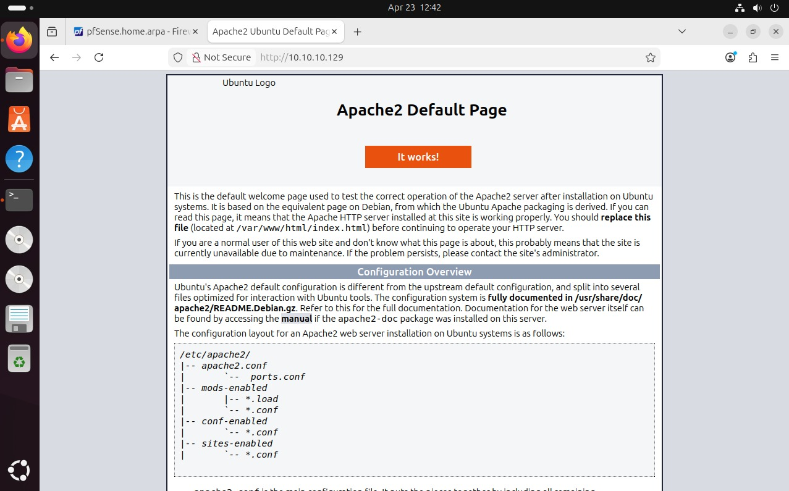
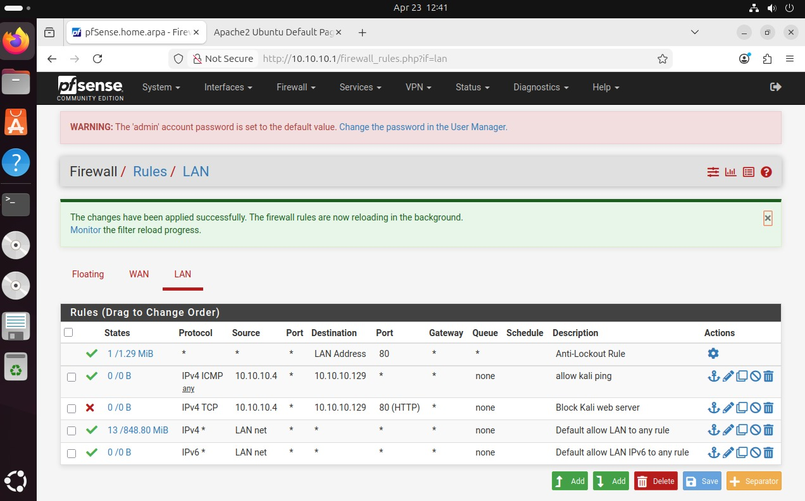
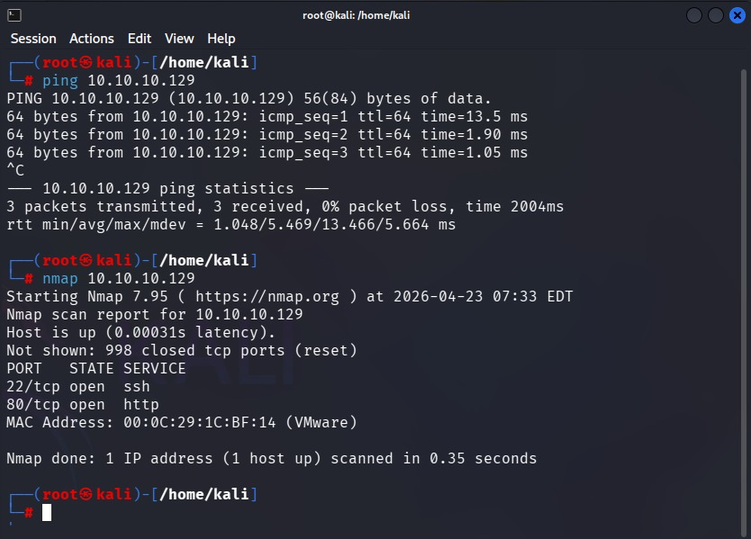

# 🔐 pfsense-virtual-security-lab (pfSense + Kali + Ubuntu)

## 📌 Overview
This project is a simple cybersecurity lab built using VMware.

It simulates a small network with:
- pfSense (Firewall)
- Ubuntu Server (Apache Web Server)
- Ubuntu Desktop (Client)
- Kali Linux (Attacker)

The goal is to understand how firewall rules control access between machines.

---

## 🖥️ Lab Machines

| Machine         | Role                | IP Address        |
|-----------------|---------------------|------------------|
| pfSense         | Firewall / Router   | 10.10.10.1       |
| Ubuntu Server   | Web Server (Apache) | 10.10.10.129     |
| Ubuntu Desktop  | Client              | 10.10.10.128     |
| Kali Linux      | Attacker            | 10.10.10.4       |

---

## 🌐 Network

- LAN: 10.10.10.0/24
- VMware Network: Host-only (VMnet1)
- pfSense acts as the gateway

---

## 🎯 Objectives

- Host a web server using Apache2
- Allow internal users to access it
- Simulate an attacker using Kali Linux
- Block malicious access using firewall rules

---

## 🔥 Firewall Rules

### Allowed
- Ubuntu Desktop → Web Server (HTTP)
- Kali → Web Server (ICMP / ping)

### Blocked
- Kali → Web Server (HTTP port 80)

---

## 🧪 Testing

### From Ubuntu Desktop
http://10.10.10.129  
✔️ Web server is accessible

### From Kali
```bash
nmap 10.10.10.129
```

Expected:
- Port 80 → blocked/filtered
- Port 22 → open

---

## 📸 Screenshots

### Apache Web Server (Working)


### pfSense Firewall Rules


### Kali Nmap Scan


---

## 🛠️ Tools Used

- VMware Workstation
- pfSense
- Ubuntu Server (Apache2)
- Ubuntu Desktop
- Kali Linux
- Nmap

---

## 📚 What I Learned

- How to configure pfSense firewall rules
- Network segmentation basics
- Hosting a web server
- Simulating attacks using Kali
- Importance of firewall rule order

---


## 🧠 Conclusion

This lab demonstrates how firewall rules can control access between systems and protect services from unauthorized users.
